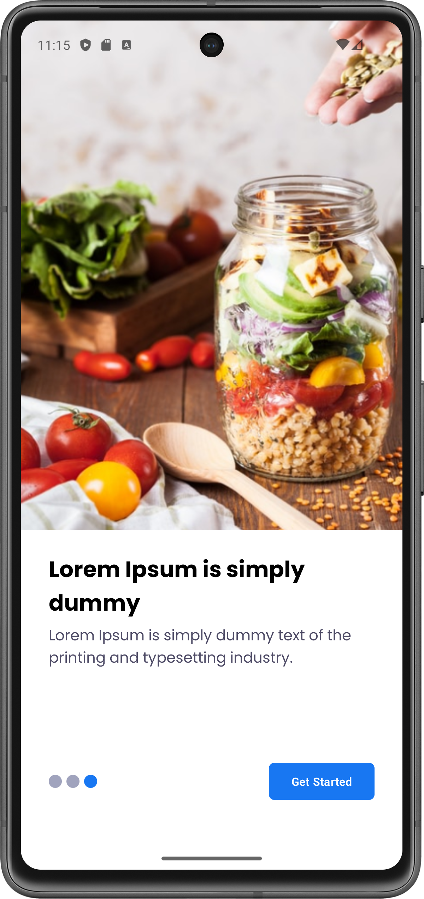
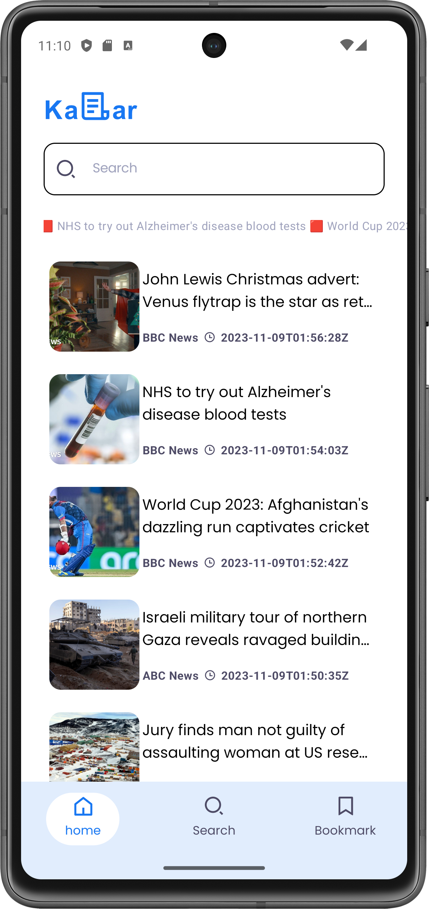
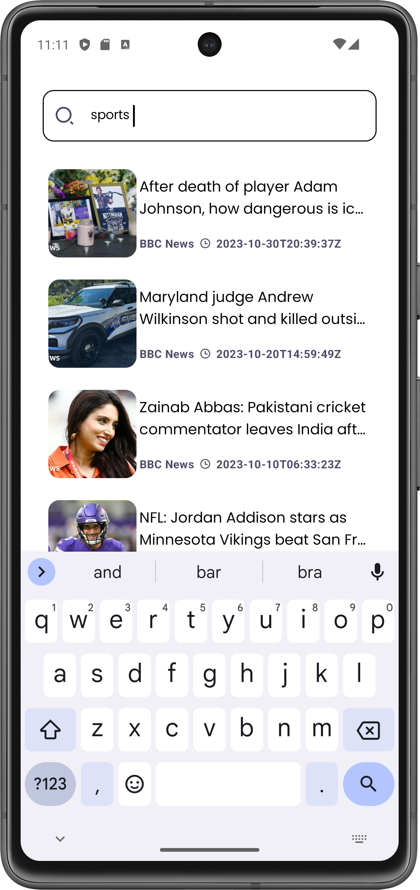
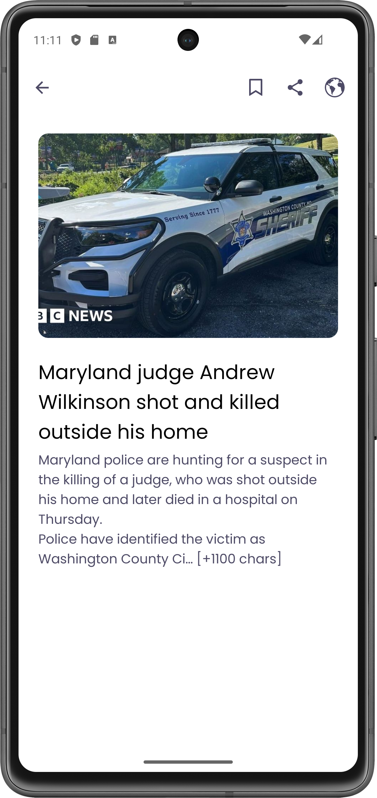

# NewsAppCompose
This repository follows course from YouTube on channel named Land of coding. The course's Jetpack Compose Clean Architecture

## Screens
<h1 align="center">
  
  
  
  
  

</h1>

## Technologies
<ul>
  <li>Jetpack Compose </li>
  <li>Clean Architecture</li>      
  <li>MVVM </li>
  <li>Paging 3</li>
  <li>Retrofit</li>
  <li>Room</li>
  <li>Dagger Hilt</li>
</ul>
 

 

